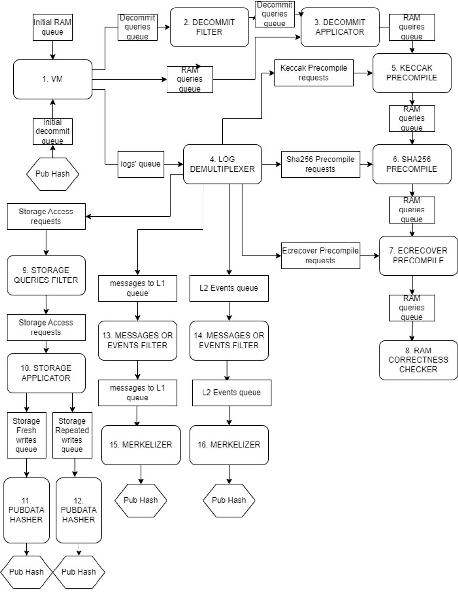

# Circuits

## General description

The main circuit is called `MainVM`. It is the one where all the main logic happens. 

It consists of multiple cycles, where on each iteration we take a next opcode and try to execute it the following way:

```rust
if opcode == Add {
	// do addition
}
if opcode == SRead {
	// do storage read
}
...
```

You may notice that `Add` instruction is much simpler than the `SRead` one. And when you work with circuits you still need to execute every opcode. 

That’s why we can use the following approach:

```rust
if opcode == Add {
	// do addition
}
if opcode == SRead {
	storage_queue.push((address, value));
	// proof storage read in other circuit
}
...
```

So instead of proving `SRead` we just push a proving request, that will be sent to another circuit, that will prove it. That’s how we can make our prover structure more optimized and flexible.

For now, we have 13 base layer circuits:

- [MainVM](https://www.notion.so/Main-Vm-afc33e249af14d6eb270368407ec200e?pvs=21)
- [CodeDecommittmentsSorter](https://www.notion.so/SortDecommitments-8b6c67c18d4b456a835ddbe87fd0175e?pvs=21)
- [CodeDecommitter](https://www.notion.so/CodeDecommitter-c54f2049d0f44522ad238d1a288b448e?pvs=21)
- [LogDemuxer](https://www.notion.so/DemuxLogQueue-f1f2522687294350a22ca313aecda6b5?pvs=21)
- [KeccakRoundFunction](https://www.notion.so/KeccakRoundFunction-57ca16f7209c49e6879b714c59d2c6d7?pvs=21)
- [Sha256RoundFunction](https://www.notion.so/Sha256RoundFunction-431ad91475714330ab5211ad001ff8c8?pvs=21)
- [ECRecover](https://www.notion.so/Ecrecover-ca9893305fe340daabf1ae8369d53b31?pvs=21)
- [RAMPermutation](https://www.notion.so/RAMPermutation-255cfb648b584ab49f75bf458b17130b?pvs=21)
- [StorageSorter](https://www.notion.so/StorageSorter-611de56e0cfc49e8a9831e4b0d1b3cdd?pvs=21)
- [StorageApplication](https://www.notion.so/StorageApplication-1db7e49f5b0e405fb011d42eb13b9d4f?pvs=21)
- [EventsSorter](https://www.notion.so/LogSorter-4a0fa92896c448f5995ffc94bee075bc?pvs=21)
- [L1MessagesSorter](https://www.notion.so/LogSorter-4a0fa92896c448f5995ffc94bee075bc?pvs=21)
- [L1MessagesHasher](https://www.notion.so/L1MessagesHasher-4c04d8ff62d1402c847c22a7bc0ac5b0?pvs=21)

They mostly communicate by queues (the diagram  of communication is below).

## Public Input structure

Public Input (PI) is some piece of data, that is revealed to the verifier. Usually, it consists of some inputs and outputs.

The main challenge for base layer circuits is the ability to prove unlimited amount of execution. For example, our `MainVm` circuit can handle execution of $x$ opcodes. Then, if some transaction causes execution of more than $x$ opcodes, we won’t be able to prove it. That’s why every circuit could be extended to multiple instances. So you can always use $n$ `MainVm` instances to handle up to $nx$ opcode executions.

All circuits have the following PI structure:


| start flag | Boolean that shows if this is the first instance of corresponding circuit type |
| --- | --- |
| finished flag | Boolean that shows if this is the last instance of corresponding circuit type |
| Input | Structure that contains all inputs to this type of circuit (every instance of one circuit type has the same input) |
| Output | Structure that contains all outputs of this type of circuit (the last instance contains the real output, the output field of the others is empty) |
| FSM Input and FSM Output | The field has the same structure. It represents the inner state of circuit execution (the first fsm_input is empty, the second fsm_input equals the first fsm_output and so on…) |


The equality of corresponding parts in different circuits is done during aggregating base layer circuits. Aggregating is done by recursion level circuits that also verify base layer proofs. For now this is out of our scope, so we will focus only on base layer.

## How do all of the base layer circuits fit together?



## All base layer circuits

[Main Vm](https://www.notion.so/Main-Vm-afc33e249af14d6eb270368407ec200e?pvs=21)

[SortDecommitments](https://www.notion.so/SortDecommitments-8b6c67c18d4b456a835ddbe87fd0175e?pvs=21)

[CodeDecommitter](https://www.notion.so/CodeDecommitter-c54f2049d0f44522ad238d1a288b448e?pvs=21)

[DemuxLogQueue](https://www.notion.so/DemuxLogQueue-f1f2522687294350a22ca313aecda6b5?pvs=21)

[KeccakRoundFunction](https://www.notion.so/KeccakRoundFunction-57ca16f7209c49e6879b714c59d2c6d7?pvs=21)

[Sha256RoundFunction](https://www.notion.so/Sha256RoundFunction-431ad91475714330ab5211ad001ff8c8?pvs=21)

[Ecrecover](https://www.notion.so/Ecrecover-ca9893305fe340daabf1ae8369d53b31?pvs=21)

[RAMPermutation](https://www.notion.so/RAMPermutation-255cfb648b584ab49f75bf458b17130b?pvs=21)

[StorageSorter](https://www.notion.so/StorageSorter-611de56e0cfc49e8a9831e4b0d1b3cdd?pvs=21)

[StorageApplication](https://www.notion.so/StorageApplication-1db7e49f5b0e405fb011d42eb13b9d4f?pvs=21)

[LogSorter](https://www.notion.so/LogSorter-4a0fa92896c448f5995ffc94bee075bc?pvs=21)

[L1MessagesHasher](https://www.notion.so/L1MessagesHasher-4c04d8ff62d1402c847c22a7bc0ac5b0?pvs=21)
